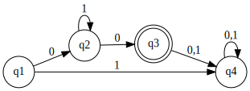

# Deterministic Finite State Automaton

To have access to the `DFA` class, you should
```python
from pytomaton.dfa import DFA
```
For creating an instance of a `DFA` you have to provide it:
- the input alphabet
- the states
- the initial state
- final states
- the transitions (a `dict`)

`DFA`s have to have one transition for each input alphabet symbol from each state. Also, epsilon-transitions are not allowed.

Let's take as an example this automaton that accepts the language `01*0`



and its corresponding code

```python
from pytomaton.dfa import DFA

alphabet = ['0', '1']
states = ['q1', 'q2', 'q3', 'q4']
initial = 'q1'
finals = {'q3'}
transitions = {
    'q1': {
        '0': {'q2'},
        '1': {'q4'}
    },
    'q2': {
        '0': {'q3'},
        '1': {'q2'}
    },
    'q3': {
        '0': {'q4'},
        '1': {'q4'}
    },
    'q4': {
        '0': {'q4'},
        '1': {'q4'}
    }
}

dfa = DFA(alphabet, states, initial, finals, transitions)
```

For checking if the authomaton accepts certain word, call `dfa.accepts(<word>)`, that returns a boolean.

```python
>>> dfa.accepts('')
False
>>> dfa.accepts('00')
True
>>> dfa.accepts('010')
True 
>>> dfa.accepts('01111110')
True
>>> dfa.accepts('0100')
False
```

If you wish to see the execution step by step, call `dfa.read(<word>, show_steps=True)`. Here 'Clock'
lets us know in which step we are.<br>
If you are only interested in the final states and the input symbols not read, call it without the `show_steps` argument.

```python
>>> dfa.read('0100', show_steps=True)
Clock: 0, Current States: ['q1'], Remaining Input: '0100'
Clock: 1, Current States: ['q2'], Remaining Input: '100'
Clock: 2, Current States: ['q2'], Remaining Input: '00'
Clock: 3, Current States: ['q3'], Remaining Input: '0'
Clock: 4, Current States: ['q4'], Remaining Input: ''
('', ['q4'])
```
notice that the last line is the return value from the call to `read()`
```python
>>> dfa.read('0100')
('', ['q4'])
```