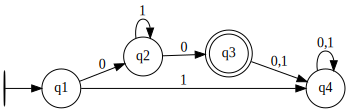

# Autômatos Finitos Determinísticos

Para ter acesso à classe `DFA`, você importá-la da seguinte forma:
```python
from pytomaton.dfa import DFA
```
Para criar uma instância da classe `DFA` você deve passar como argumentos:
- o alfabeto de entrada
- os estados do autômato
- o estado inicial
- os estados finais
- as transições (como um `dict`)

Os `DFA`s devem ter uma transição para cada símbolo de entrada para cada estado. Além disso, transições epsilon não são permitidas.

Vamos tomar como exemplo o autômato que aceita a linguagem `01*0`



e seu código correspondente

```python
from pytomaton.dfa import DFA

alphabet = ['0', '1']
states = ['q1', 'q2', 'q3', 'q4']
initial = 'q1'
finals = {'q3'}
transitions = {
    'q1': {
        '0': {'q2'},
        '1': {'q4'}
    },
    'q2': {
        '0': {'q3'},
        '1': {'q2'}
    },
    'q3': {
        '0': {'q4'},
        '1': {'q4'}
    },
    'q4': {
        '0': {'q4'},
        '1': {'q4'}
    }
}

dfa = DFA(alphabet, states, initial, finals, transitions)
```

Para vericicar se o autômato aceita determinada palavra, chame `dfa.accepts(<word>)`, que
retorna um valor booleano.

```python
>>> dfa.accepts('')
False
>>> dfa.accepts('00')
True
>>> dfa.accepts('010')
True 
>>> dfa.accepts('01111110')
True
>>> dfa.accepts('0100')
False
```

Se você desejar visualizar a execução passo a passo, chame `dfa.read(<word>, show_steps=True)`. Aqui, 
'Clock' nos permite saber em que passo da execução nós estamos.<br>
Se você estiver interessado só nos estados finais e nos símbolos de entrada não lidos, chame a função sem o argumento `show_steps`.

```python
>>> dfa.read('0100', show_steps=True)
Clock: 0, Current States: ['q1'], Remaining Input: '0100'
Clock: 1, Current States: ['q2'], Remaining Input: '100'
Clock: 2, Current States: ['q2'], Remaining Input: '00'
Clock: 3, Current States: ['q3'], Remaining Input: '0'
Clock: 4, Current States: ['q4'], Remaining Input: ''
('', ['q4'])
```

note que a última linha é o valor de retorno à chamada de `read()`

```python
>>> dfa.read('0100')
('', ['q4'])
```