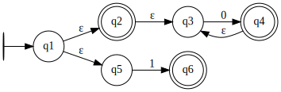

# Autômatos Finitos Não Determinísticos

Para ter acesso à classe `NDFA`, você deve importá-la da seguinte forma:

```python
from pytomaton.ndfa import NDFA
```

Para criar uma instância da classe `NDFA` você deve passar como argumentos:
- o alfabeto de entrada
- os estados do autômato
- o estado inicial
- os estados finais
- as transições (como um `dict`)

Os `NDFA`s não têm as mesmas restrições que os `DFA`s. Por exemplo: você não precisa escrever
uma transição para cada símbolo de entrada possível para cada estado. Além disso, você pode
ter mais de uma transição para o mesmo estado e símbolo de entrada.
Em outras palavras, dado um estado `q` e um símbolo de entrada `i`, você pode ter 0 ou mais transições
a partir de `q` consumindo o símbolo `i` da palavra de entrada.<br>
Outra caracteristica dos `NDFA`s é que você pode ter transições epsilon -- transições que não leem nenhum
símbolo da entrada. Aqui epsilon é denotado pelo caractere '&'.

Vamos dar uma olhada no autômato que aceita a linguagem `0* U 1`



e seu código correspondente

```python
from pytomaton.ndfa import NDFA

alphabet = ['0', '1']
states = ['q1', 'q2', 'q3', 'q4', 'q5', 'q6']
initial = 'q1'
finals = {'q2', 'q4', 'q6'}
transitions = {
    'q1': {
        '&': {'q2', 'q5'} # two possible epsilon-transitions from the state 'q1'
    },
    'q2': {
        '&': {'q3'}
    },
    'q3': {
        '0': {'q4'}
    },
    'q4': {
        '&': {'q3'}
    },
    'q5': {
        '1': {'q6'}
    }
}

ndfa = NDFA(alphabet, states, initial, finals, transitions)
```

Para verificar se o autômato aceita determinada palavra, chame `ndfa.accepts(<word>)`, que retorna
um valor booleano.

```python
>>> dfa.accepts('')
True
>>> ndfa.accepts('1')
True
>>> ndfa.accepts('00')
True
>>> ndfa.accepts('000000000')
True
>>> ndfa.accepts('001')
False
>>> ndfa.accepts('10')
False
```

Se você desejar visualizar a execução passo a passo, chame `dfa.read(<word>, show_steps=True)`.
Se você estiver interessado só nos estados finais e nos símbolos de entrada não lidos, chame a função sem o argumento `show_steps`.
<br>
Quando lendo os passos da execução, você pode se deparar com mais de um estado atual (`Current States`).
Isso é por causa do não determinismo do `NDFA`. Neste simulador, nós utilizamos o conceito de um relógio,
para que possamos facilmente saber em que passo da execução estamos no momento. Cada tique do relógio
corresponde a um símbolo da entrada consumido. No caso de autômatos não determinísticos, realizamos todas
as transições epsilon antes do próximo tique do relógio. Aqui está um exemplo disso:

```python
>>> ndfa.read('001', show_steps=True)
Clock: 0, Current States: ['q1', 'q5', 'q2', 'q3'], Remaining Input: '001'
Clock: 1, Current States: ['q4', 'q3'], Remaining Input: '01'
Clock: 2, Current States: ['q4', 'q3'], Remaining Input: '1'
Clock: 2, Current States: ['q4', 'q3'], Remaining Input: '1'
('1', ['q4', 'q3'])
```
note que a última linha é o valor de retorno da chamada de `read()`

```python
>>> dfa.read('001')
('1', ['q4', 'q3'])
```

Para que uma palavra seja aceita por um `NDFA` basta que haja **pelo menos** um estado final
entre os estados retornados por `ndfa.read(<word>)` (os estados alcançáveis pela palavra de entrada dada).